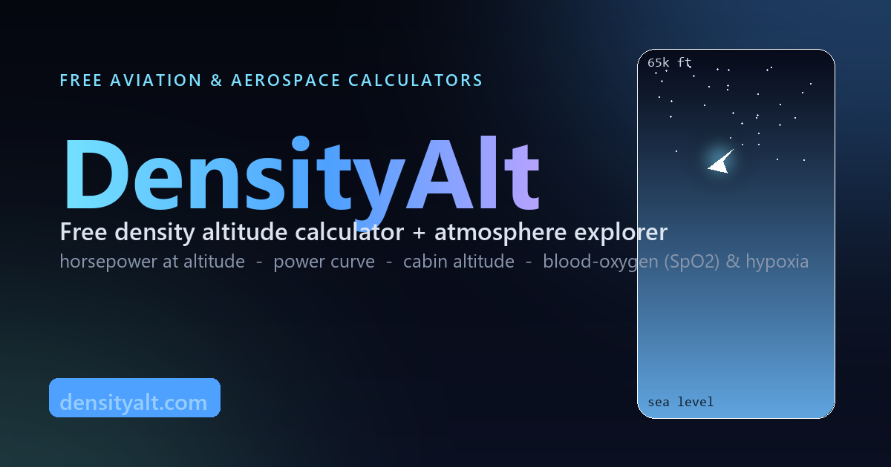

# DensityAlt

**Free density altitude calculator + an interactive atmosphere & hypoxia explorer** — a small suite of altitude-physics tools for pilots, student pilots, CFIs, and aerospace enthusiasts.

🔗 **Live:** [densityalt.com](https://densityalt.com)

## ⚠️ Disclaimer

**Educational estimates only.** DensityAlt is **not for flight planning, dispatch, weight-and-balance, or medical use.** The physiological models are for healthy, unacclimatized adults at acute exposure and will not match any individual. Always fly the numbers in your POH/AFM and current official weather. Use of this tool is at your own risk.

## License

The **code** is released under the [MIT License](LICENSE) — reuse it, learn from it, build on it.

The **"DensityAlt" name, logo, favicon, and Open Graph image are not covered by the MIT license** and remain trademarks/brand assets of their owner. If you fork this, please ship it under your own name and branding.

## What's inside

1. **Atmosphere & hypoxia explorer** — drag an aircraft up a 0–65,000 ft column and watch pressure, density, ISA temperature, ambient and alveolar oxygen pressure, and blood-oxygen saturation (SpO₂) move together in real time, alongside the oxygen–hemoglobin dissociation curve and FAR 91.211 / time-of-useful-consciousness / Armstrong-limit flags.
2. **Density altitude calculator** — field elevation + temperature + altimeter setting → pressure altitude, ISA deviation, and density altitude, with an interactive density-altitude-vs-temperature chart.
3. **Horsepower at altitude** — how a piston engine's power falls with density altitude (Gagg–Ferrar), with turbocharger critical-altitude handling.
4. **Power curve & region of reversed command** — the U-shaped power-required curve (induced + parasite drag), V-speeds, excess power, and the "back side of the power curve," shifted by density altitude.
5. **Cabin altitude calculator** — pressurized cabin altitude from each aircraft's maximum pressure differential (ΔP), plus the cabin SpO₂ that comes with it.

All charts are interactive (drag to scrub) and recompute live.

## Tech

- **Vanilla HTML + CSS + JavaScript** in a single file (`index.html`) — no build step, no framework, no dependencies.
- Charts are hand-drawn on `<canvas>` (hi-DPI aware, redrawn on resize).

## How the numbers are computed

- **Atmosphere** — International Standard Atmosphere (ISA): the barometric formula in the troposphere, and the isothermal layer above the tropopause.
- **Blood oxygen** — alveolar gas equation feeding the Severinghaus SpO₂ relation; tuned to published acute-exposure SaO₂ data.
- **Density altitude** — `PA = elev + (29.92 − altimeter)·1000`, then `DA = PA + 120·(OAT − ISA temp)`.
- **Horsepower** — Gagg–Ferrar relation `HP ≈ rated·(1.132σ − 0.132)`, σ = density ratio.
- **Power curve** — parabolic drag polar `C_D = C_D0 + C_L²/(πAR·e)`; power required = drag × TAS (1g level flight at gross weight).
- **Cabin altitude** — `cabin_P = min(sea level, ambient + ΔP)`, inverted to an altitude.

## References

- FAA *Pilot's Handbook of Aeronautical Knowledge* (FAA-H-8083-25) and *Airplane Flying Handbook* (FAA-H-8083-3) — density altitude, the FAR 91.211 oxygen rules, and the power curve / region of reversed command.
- J.D. Anderson, *Introduction to Flight* — parabolic drag polar and the power-required curve.
- Alveolar gas equation + Severinghaus SpO₂ relation, with acute-exposure SaO₂ figures from high-altitude physiology literature (e.g. J.B. West).
- Power-curve V-speeds and the narrow trainer reversed-command band cross-checked against Van's Air Force, GoFly, and Boldmethod.

## Contributing

Found a wrong number, an airport that won't look up, or have a tool idea? Open an issue.
